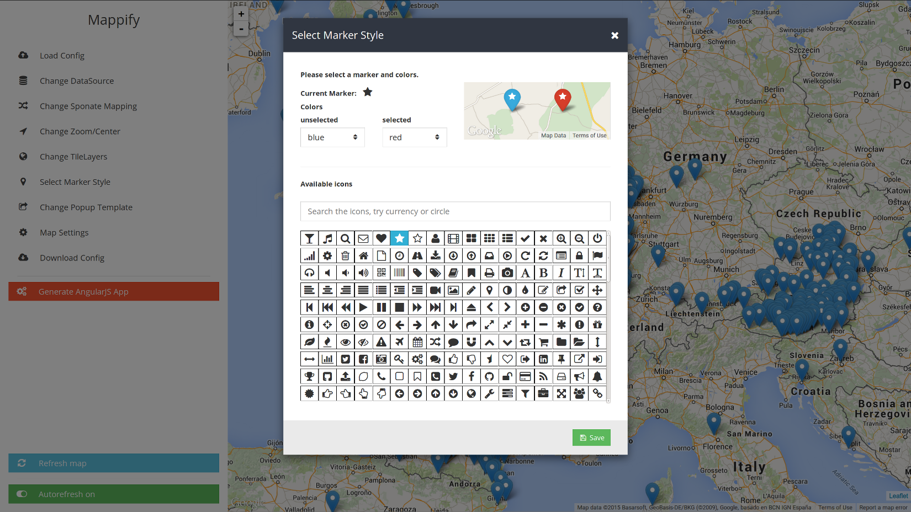

# Mappify

###demo

demo:  [demo](http://geoknow.github.io/Mappify/#/) 

### Getting Started

  - open mappify
  - select "Load Config" and choose a predefined example
  - you can play round with an preview by pressing "Refresh map" for an preview
  - you can generate and download the AngularJS-app by selecting "Generate AngularJS App"

###install:

current develop branch: [link](https://github.com/danielkeil/mappify/tree/feature/datascource_support)

- npm install
- bower install
- gulp dev
